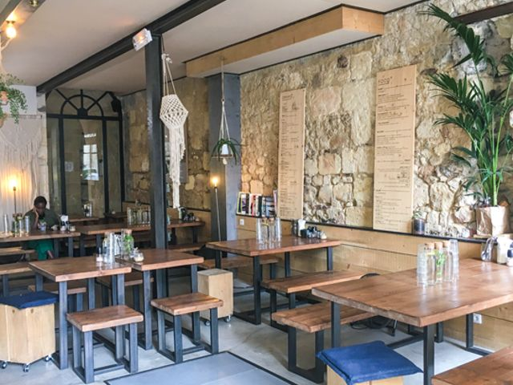

## description

Cynthia et Camille on voulu créer un lieu où elles adoreraient aller en tant que cliente qui leur rappellerait les petits cafés qui les ont inspiré en se promenant à l'étranger. Elles y ont ajouté des produits da qualité et leur passion pour la cuisine et les produits qui ont du goût !  
  
Pn'P, c'est un café où on peut manger toute la journée sucré comme salé et où tout est fait maison à partir de produits frais de saison (en favorisant petits producteurs, local & bio)  

L'idée dans -Personne n'est Parfait c'est de cultiver les singulières habitudes alimentaires de chacun·e, où des amis qui mangent complètement différemment, gras ou _healthy_ graines ou bacon peuvent venir manger au même endroit et se régaler
  
## En je

J'aime me poser à Pn'P je trouve Camille et Cynthia vraies, elles sont discrètement prévenantes. C'est agréable de prendre un peu de temps pour y travailler, je n'ai pas l'impression de déranger, j'imagine qu'elles n'hésiteraient pas à me prévenir s'il y avait un problème

