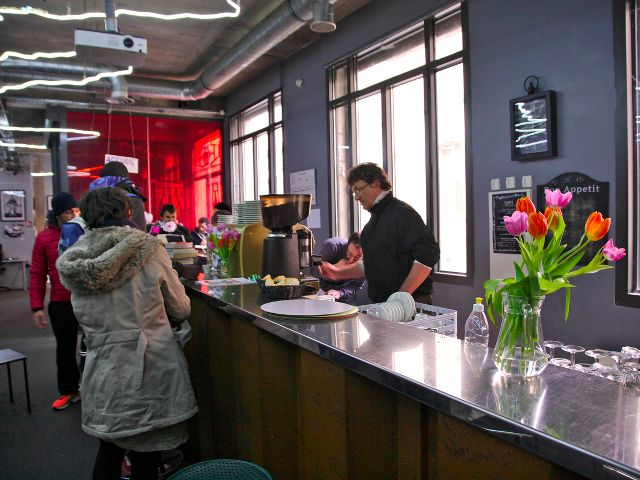

## description

Ouverts à tous les habitants, chacun peut y trouver toutes sortes d'activités et de services : culture, insertion, loisirs, logement, garde d'enfants, etc. Accueil, écoute et proximité sont les maîtres-mots de cette structures.

