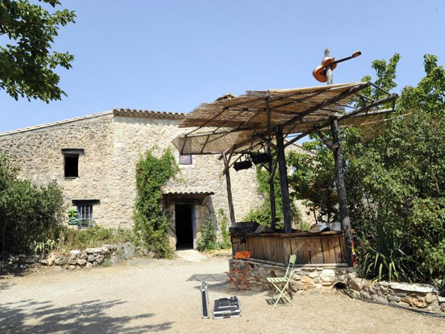

## description

À quelques 40 kilomètres de Montpellier, la terre rocailleuse du Causse de la Selle abrite La Grange et son bouillonnement d’activités. Bouillon cube a investi les lieux depuis la création de l’association en 2006, et s’attache à développer un pôle d’activités culturelles et éducatives dans ce vieux mas en pierres.  
  
Ce lieu chargé d’histoires, propose aujourd’hui toutes sortes d’activités originales : concerts, spectacles, résidences d’artistes, échanges européens, ateliers et séjours pour les plus jeunes.

