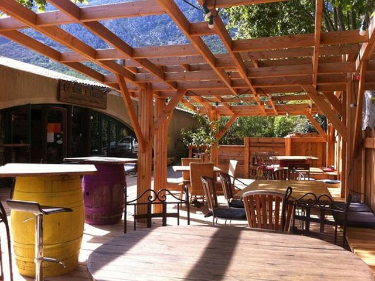

## description

Un tiers-lieu convivial. Claire prend beaucoup de temps et de soin pour mener à bien son projet. Elle souhaite accueillir tout les habitants, les jeunes et les anciens. Désireuse de créer un lien entre les habitants de St Jean et du coin, les visiteurs de passage, les curieux d'un soir, les randonneurs du dimanche, les amoureux de la vallée. Pour l'instant elle accueille des enfants avec une bibliothèque salle de jeux dédiée, elle produit des soirées et a pour projet d'ouvrir une épicerie solidaire.

 