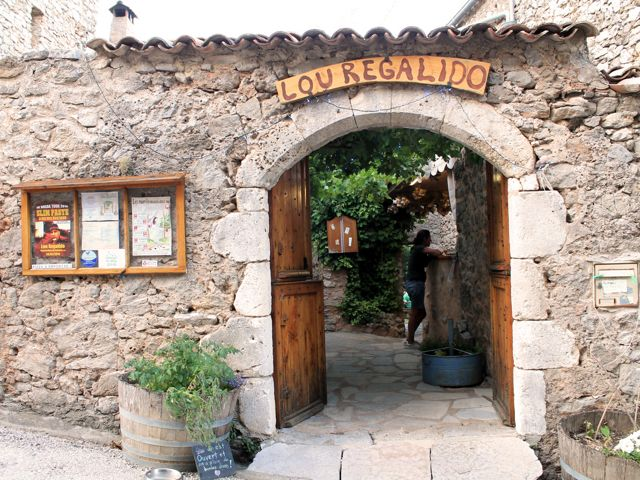

## Description

À proximité de la source de la Buèges, le restaurant Lou Régalido accueil dans un cadre simple et convivial.  
Une grande terrasse qui offre une vue sur la vallée de grandes table en bois et un petit coin spécialement aménagé pour l'intimité.  
L'équipe s'applique à travailler avec les producteurs locaux pour proposer une cuisine simple et de qualité, pizzas, grillades au four à bois, salades et glaces artisanales.  
L'été des événements (concert, spectacles) sont organisés une fois par semaine.
Deux salles voutées complètent également pour accueillir par mauvais temps.

