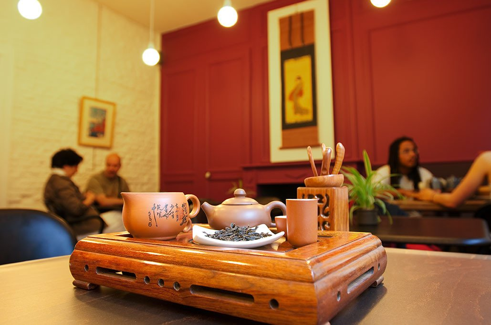

## description

Loin du CTC (thé en sachet) théine propose une gamme de thé souvent bio et de qualité. La boutique est tenu par de vrai amoureu·se·x de la culture du thé. On y trouve des thés, des céramiques et des poteries d'exception en provenance de Thaïlande, du Laos, d'Inde, de Chine et du Japon. La boutique propose également un large choix d'infusions de plantes venues d'Auvergne.

