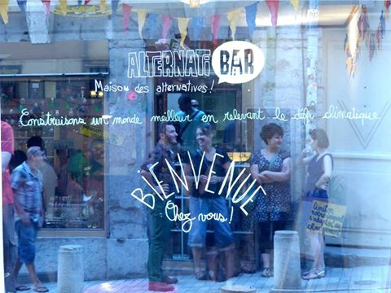

## description

Placé sous le signe de la convivialité et de l’ouverture à toutes les cultures, l’AlternatiBar propose une programmation 
diversifiée, qui fait la part belle à la découverte d’alternatives émancipatrices et à l’échange 
(atelier pratiques, projections-débats, journées thématiques, conférences),à la musique (concerts, ateliers…).
Lieu de débat, de sensibilisation, de circulation des idées, l’AlternatiBar contribue à tisser des liens entre 
les nombreux acteur.ice.s de la transition écologique et sociale.

