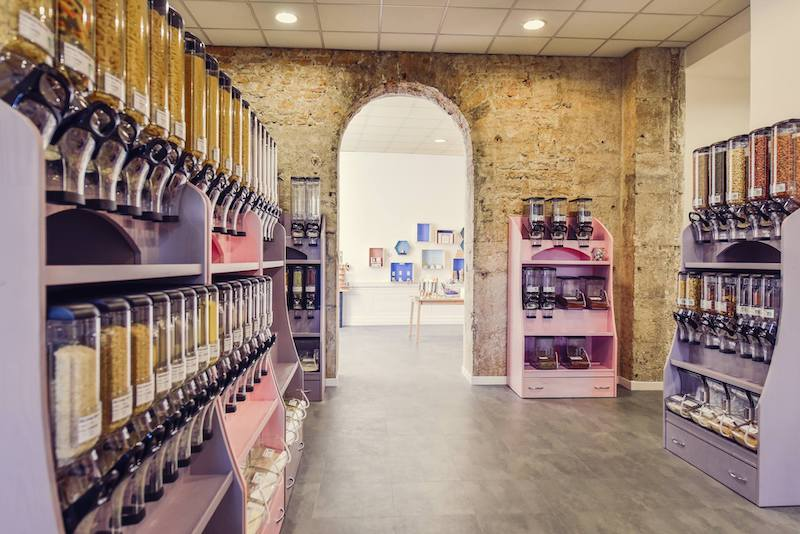

## description

Bulko souhaite faciliter l’accès au mode de vie zéro déchet en proposant un large choix de produits
vendus sans emballages jetables allant des produits frais aux produits secs en passant par les cosmétiques
et les produits d’entretien. L'épicerie propose aussi des ateliers sur divers thèmes afin d’approfondir la réflexion
sur un mode de vie plus heureux et plus responsable. 

