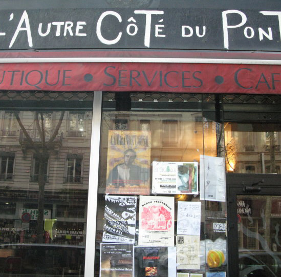

## description

Un bar-restaurant convivial, avec une cuisine élaborée à partir de produits locaux, artisanaux et frais. D'octobre à juin,
une quinzaine de spectacles sont produits, à des tarifs accessibles. 
De l'Autre Côté du Pont c'est aussi un lieu militant d'expérimentation sociale, économique et environnementale.
A découvrir et redécouvrir à chaque visite.

