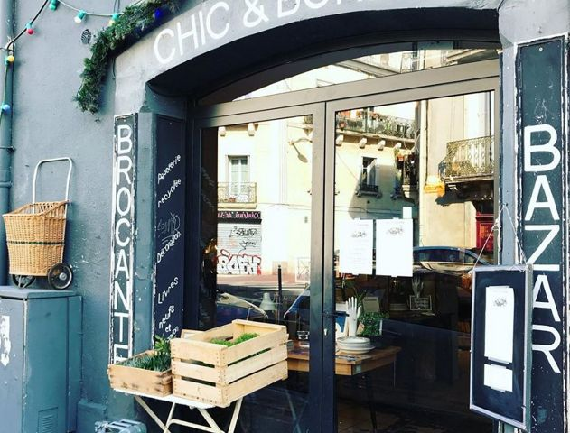

## description

Une belle brocante avec un joli choix de meubles et objets et une petite terrasse pour déjeuner l'été. Les plats sont fait maison, la boutique est composée de grande salle dont l'une sert de restaurant.  
C'est à la fois calme, surprenant et dépaysant.

