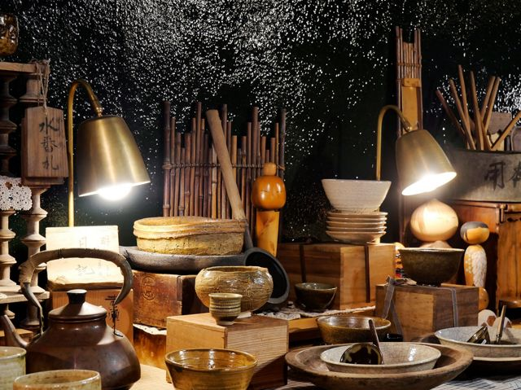

## description

Olivier et Nadia passionné·e·s de belles choses présentent des marques de créateurs et une sélection d’objets japonais. Le magasin est en évolution permanente et propose régulièrement de nouvelles créations. L’équipe organise des « installations » qui mettent des artistes en valeur.

> Je fabrique ce que j’aime bien, donc je cherche, j’achète et je revends ce que j’aime bien. Tout part des tripes et non de la tête. Si la matière, la coupe, la distribution est particulière, je prends. Je ne m’interdis rien. On trouve donc des chaussures, de la lumière, de l’art de la table, des objets de décoration, du vêtement et même de la musique chez De la luce. - Olivier

