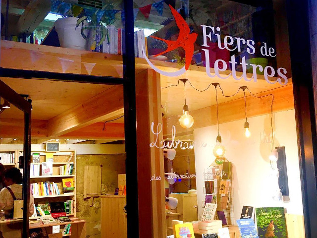

## description

Une librairie engagée et chaleureuse où l'on peut siroter une boisson en feuilletant des livres ou en travaillant. Fiers de lettres fait la promotion des initiatives porteuses de solutions alternatives et durables et encourage le passage à l’action des citoyens au bénéfice d’une économie plus solidaire. Wissam et Chloé veulent contribuer au changement majeur en émergence et inspirer, à travers les livres, des modes de vie et de faire plus durables  

