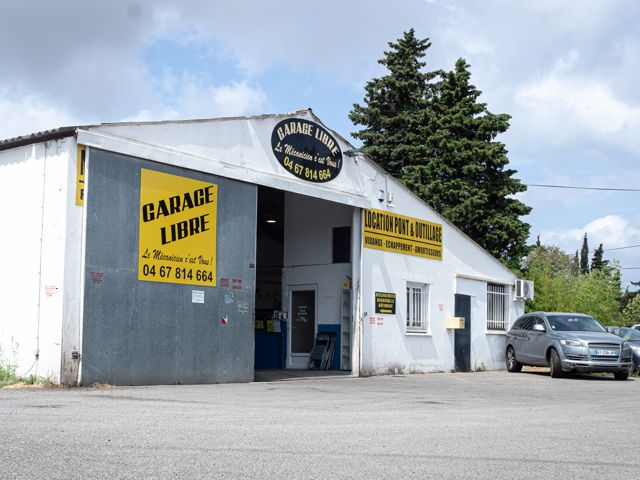

## description

Le Garage Libre une entreprise familiale créée par Franck et Coralie Bruyere.  
Il vous permets de réparer vous même votre véhicule en louant les ponts ainsi que l'outillage.  
Et, sinon le garage propose de réparer le véhicule à moindre coût avec ses mécanicien·ne·s confirmé·e·s et sympathique.  

