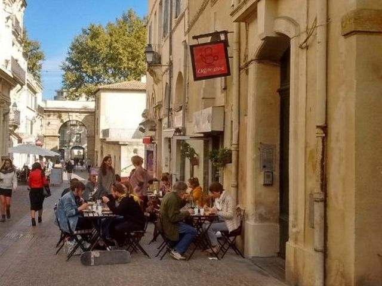

## description

À base de produits frais, et de qualité, l'Oignon Givré propose une formule composée d’une part de quiche,d’un buffet salades et d’un dessert, le tout fait maison. Une option végétarienne est proposée.
Chacun·e se sert au comptoir, et se place en salle ou en terrasse, on débarrasse sa table et on va payer sa note au comptoir.

