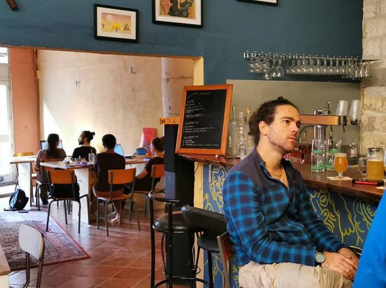

## description

Un lieu chaleureux, idéal pour découvrir des activités culturelles et se faire des ami·e·s.  
L'équipe est très accueillante et les prix sont très abordables.  
Dans la journée, le lieu est parfaitement adapté pour se poser et travailler.

