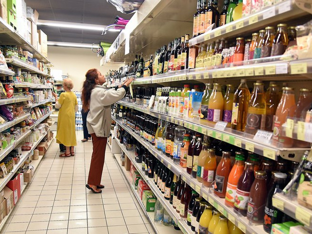

## description

La Cagette est un supermarché coopératif et participatif à but non lucratif, dont les membres participent trois heures toutes les quatre semaines et sont les seul·e·s propriétaires, les seul·e·s décisionnaires et les seul·e·s client·e·s.

