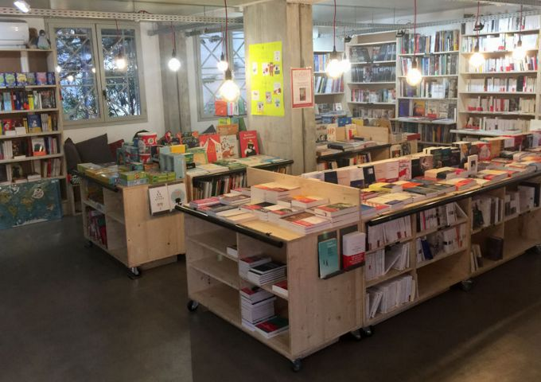

## description

> Notre ambition est de rendre le livre et la lecture accessibles au plus grand nombre et de faire de notre librairie un lieu culturel qui s’adresse à tous les publics, des plus proches aux plus éloignés du livre.

La librairie propose un choix de 13 000 ouvrages, avec un assortiment très fourni dans les sciences sociales mais aussi de la littérature générale, des livres jeunesse et de la BD.
Au quotidien, deux libraires, Marion Floris et Julien Haution, sont employés à plein temps, mais une quarantaine de coopérateurs s’impliquent aussi directement dans le fonctionnement du lieu.

