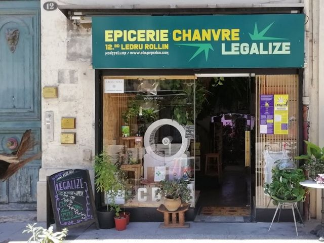

## description

Légalize est une boutique associative qui participe à démocratiser le cannabis thérapeutique. Les filles de Légalize proposent à tou·te·s de se procurer à petit prix des produits de qualité bio et certifiés en privilégiant les circuits courts et une économie solidaire et inclusive.

