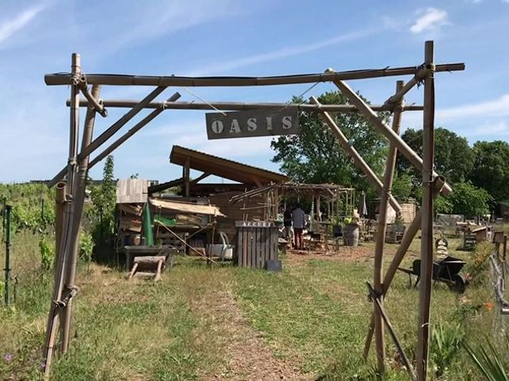

## description

L’oasis est une ferme collaborative partagée respectant les principes de la permaculture. On y apprend à jardiner, à faire ensemble et à poser les bases d'une société plus juste et respectueuse de l'environnement.
On y trouve une paillote accueil-café associatif, un poulailler, des ruches, des vignes, une centaine d'arbres, un four à pizza, des toilettes sèches et des zones où déposer son compost. Tout membre actif de l'association accède aux ateliers agroécologiques, aux cours de bien-être (yoga, qi gong, sophrologie), aux matériels, plants et semences, et peut récolter lui-même un petit panier de légumes dans le potager de 2000 m².

