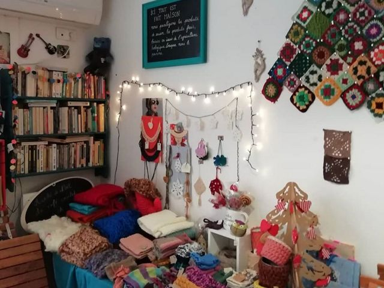

## description

Christine accueille dans un lieu familial inclusif. Nombreuses activités, petits plats sympas et lieu de vie. Un lieu à la fois convivial et artistique, un vrai espace de vie à un pas du local de la Maison des LGBT.  

