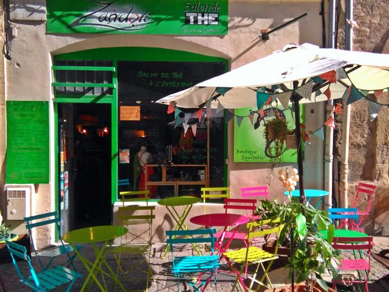

## description

En terrasse ou dans son salon, vous pourrez prendre une boisson chaude ou fraîche ou un jus de fruits pressés et peut-être déguster des pâtisseries maison orientales.  
  
À disposition, il y a des jeux de sociétés ainsi que des livres à lire sur place ou à emporter.

