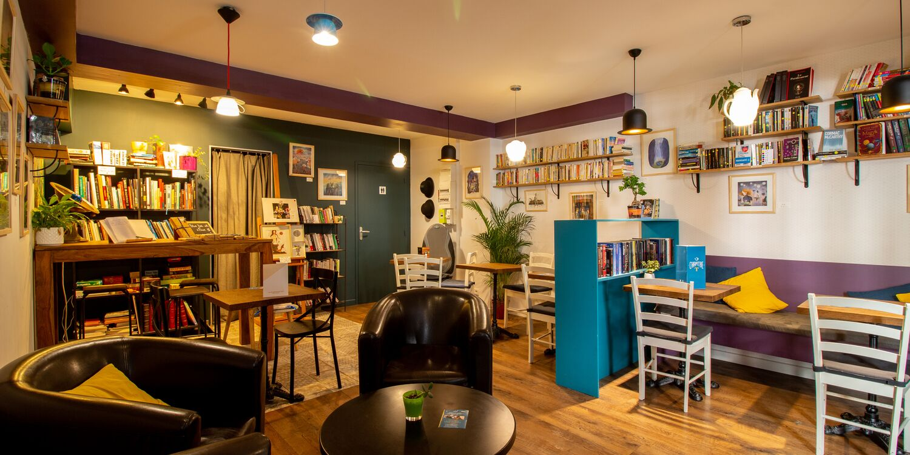

## description

On peut prendre un petit-déjeuner, y déjeuner ou bien, dans la journée, prendre un thé et une pâtisserie maison. Tout est fait maison, avec des ingrédients de qualité.
Le jeudi soir, on peut déguster des planches apéro en participant à des ateliers, des expos ou des concerts.

