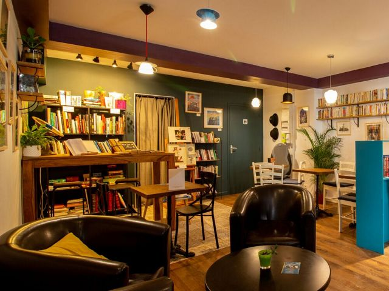

## description

On peut prendre un petit-déjeuner, y manger ou bien, dans la journée prendre un thé et une pâtisserie maison. Tout est fait maison avec des ingrédients de qualité.
On peut assister à des ateliers éphémères sur du tricot, des contes, de la sophrologie par exemple.
Consulter ou acheter des livres d'occasion. C'est aussi un peu une galerie qui accueil une exposition tous les mois et des objets de créateurs et créatrices.

> un fournisseur 

