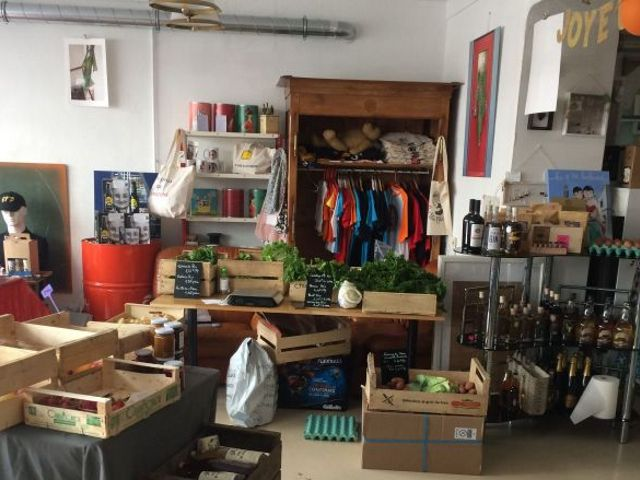

## description

Un lieu familial qui sent la brocante, les buffets, la pontoise et les capsules de bière. On y croise des épinards, des carottes, des tomates ramassés dans le potager associatif de Saint-Julien de Concelles. Karoline et Bruno s'amusent à créer du lien social, c'est comme à la maison et même un petit mieux car on y fait de belles rencontres. 

> Lieu de convivialité et de découverte de produits et créations locales, "Chez Peste et Chipie" tout se dit, se mélange, se déguste et tout peut s'emporter. Salon de bières et vins, Épicerie fine et d'art en tous genres...

