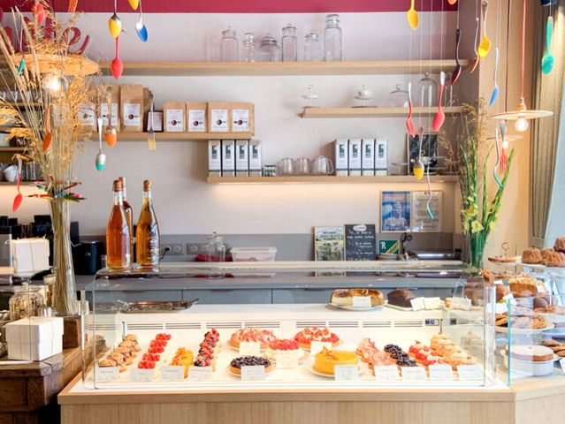

Au delà de la finesse des patisserie, l'accueil est doux et agréable. Des thés _wulong_ sont proposés avec une approche d'infusion correcte. L'approche générale est qualitative et artisanale. 

> Attentif à leur impact sur l’environnement et sur le monde qui les entoure, ils ont réfléchi à la meilleure manière de travailler en bonne intelligence avec le réseau local.
> Ils ont sélectionnés chacun de leurs partenaires pour la qualité de leurs produits, le respect de l’environnement et des saisons, sans oublier le respect humain.
> Une seule volonté, vous proposer un lieu empreint de gourmandise où les gâteaux, biscuits, chocolats et autres douceurs sucrées seront confectionnées avec une attention particulière.

