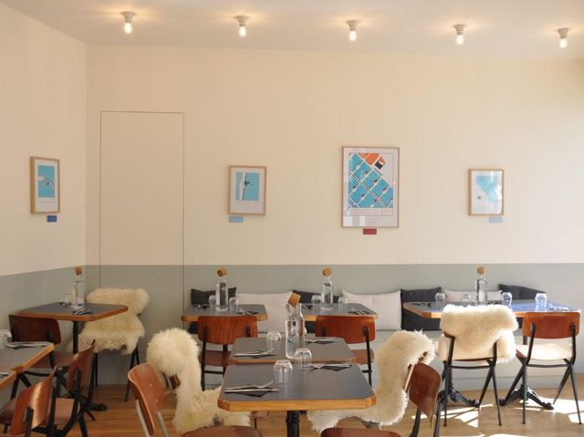

## description

 Restaurant, salon de thé, coffee-shop au design soigné le petit Glaz est devenu grand, l'ambiance est restée simple et chaleureuse. Les plats sont soignés et faits maison. On peut y travailler, petit déjeuner, prendre le temps de regarder les expositions photographiques et si le temps s'y prête lézarder en terrasse. Les personnes qui gèrent le Glaz sont très attentionnées et ça colore le lieu d'une jolie teinte bienveillante. Un brunch est proposé le dimanche qui semble être de très bonne facture.

