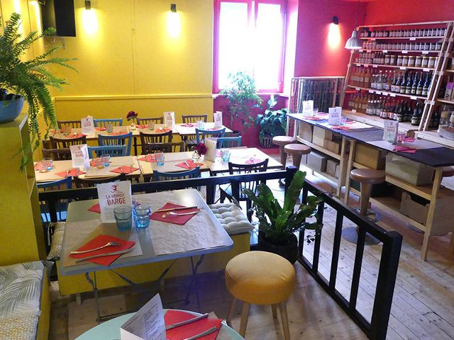

## description
Située sur L’Île de Nantes, à deux pas du bord de la Loire, La Grande Barge bénéficie d’une terrasse à l’année sur la rue Grande Biesse.  
  
Vous serez accueillis dans une ambiance chaleureuse, grâce à une déco haute en couleurs et qui met le bois à l’honneur. Un accès internet est également à la disposition des visiteurs, ainsi qu’une bibliothèque sur le thème de la cuisine. Différents types d’événements sont organisés des concerts, du théâtre d’impro, des conférences…

