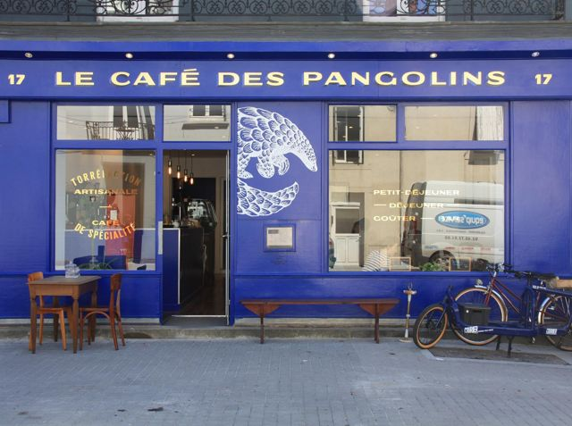

## description

Le Café des Pangolins est un café avant tout, on y torréfie sur place du café de terroirs (ou café de spécialité) et on vous prépare des espresso, cappuccino, cold brew et autres cocktails de cafés mais vous pouvez aussi venir prendre un petit déj' tardif, brunch (le dimanche) et déjeuner. Le service est continu jusqu'à épuisement des stocks. On peut y goûter, y prendre l'apéro, les Pangolins proposent aussi de la bière et du vin. On pourra piocher dans la bibliothèque une BD ou un bouquin et s'installer confortablement sur un des fauteuils ou sur le canapé pour bouquiner, jouer aux cartes ou au playmobils... 

