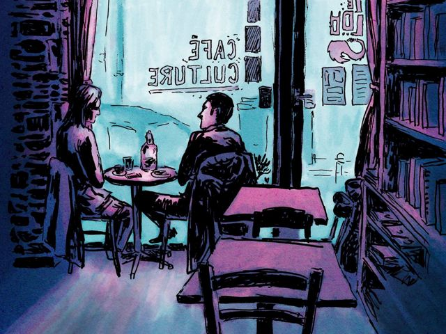

## description

Le Loo est un café librairie, salon de thé qui propose aussi une restauration en continue. Cuisine et pâtisseries maison. Les livres d'occasion sont à consulter sur place tant que vous voulez, mais aussi à vendre à petit prix ! Ateliers et évènements à suivre sur le site.  

