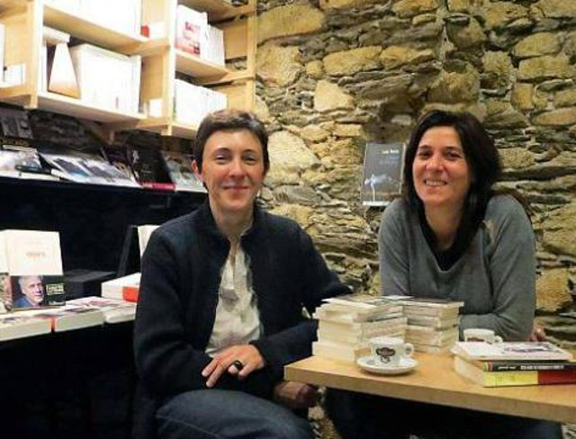

## description
Quand on a goûté à l’atmosphère, on y revient, pour lire en buvant un thé, feuilleter, choisir, commander, échanger des avis avec Géraldine et Cécile. C’est tout petit, c’est fragile et précieux,

