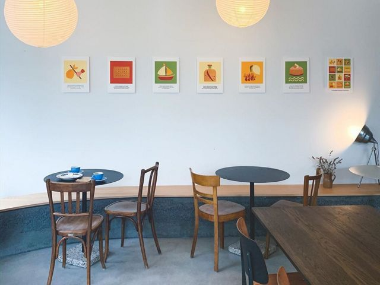

## description

Ici les ingrédients sont bios ou fermier, les farines proviennent de préférence de Loire-Atlantique, l'eau est dynamisée et micro-filtrée et tous les emballages sont compostables.  

Les artisan·e·s qui tiennent le lieu sont responsables et passionné·e·s et propose des pains d'exception.

La Maison propose un _brunch_ le samedi avec un petit lieu réservé aux enfants.

> Nous sommes un foyer de créativité à l’intersection entre la gastronomie et l’écologie. 
> Boulangerie, café et espace créatif, la Maison Arlot Cheng offre une nouvelle approche pour manger simple et mieux.
> Qu’y-a-t-il de plus simple dans la gastronomie que le pain quotidien ? Farine, eau, sel et rien d’autre que le temps pour créer la base millénaire de notre alimentation. Tout en demandant une maîtrise de l’alchimie subtile de la fermentation pour obtenir une miche de pain naturellement saine, pleine d’arômes et respectueuse de l’environnement.  
> Manger Simple. Manger Mieux. 
> Toujours Nouveaux. Jamais Tendance. 
> Ce sont les principes qui guideront Maison Arlot Cheng, au commencement, une boulangerie-café et un espace événementiel, puis une retraite et une ferme qui compléteront un écosystème créatif au service de la gastronomie et de l’écologie.

