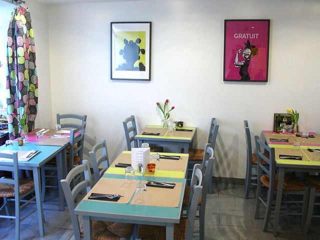

Malumbi est un restaurant de quartier qui ouvre le midi et propose des plats à emporter jusqu'à 18h pour le soir. Les habitués y viennent, pour le plaisir de la surprise, et jouent à deviner ce qui parfume leurs assiettes. À partir de 8 personnes, le lieu peut être privatisé.

> Malumbi est un restaurant de rencontres et de causeries, un endroit où l'on trouve une cuisine aux saveurs originales et des goûts venus d'ailleurs, concoctés selon l'envie et le marché du jour. Un lieu où vous ne gouterez que des plats préparés le jour même à base de produits frais. Une cuisine élaborée à partir de souvenirs de voyages, de rencontres, et d'amitiés partagées. Dans ces mûrs, vous rencontrerez une personne engagée qui vous fera partager sa passion du voyage culinaire.

