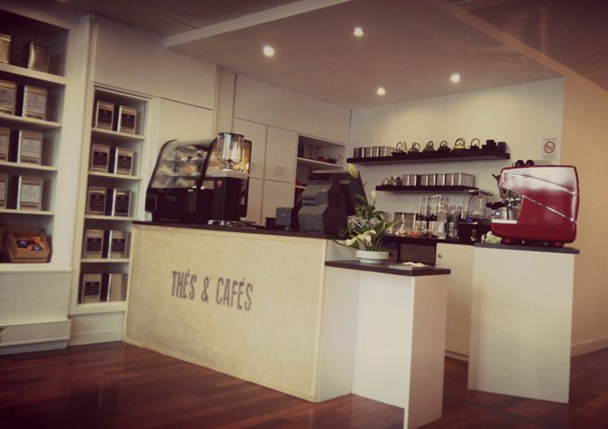

## description

Le thé est souvent maltraité, on nous propose des sachets qui sont un peu ce que le surimi est au poisson
et des aromatisés qui pour le vin serait l'équivalent des rosés pamplemousse.  
C'est aussi vrai dans les lieux qui se qualifie salons de thés, du coup, on devrait peut-être dire -maison de thés- pour qualifier l'Ôjacaranda ? 🤔
Tout est parfait ici pour déguster un thé, les prix, la qualité, l'accueil et les ustensiles.

Le paradis pour les passionné·e·s de Thé

> Ma boutique est une ouverture sur les senteurs et les saveurs des thés et des cafés. Produits à travers le monde par des maîtres de thés ou des torréfacteurs sélectionnés, ces feuilles ou ces fruits se transforment en boisson devant vous. Et c'est alors un monde fascinant qui s'ouvre, avec ses nuages de passion, de savoir faire et des secrets ! Voyagez maintenant évadez-vous assis à cette table et très bonne dégustation !

