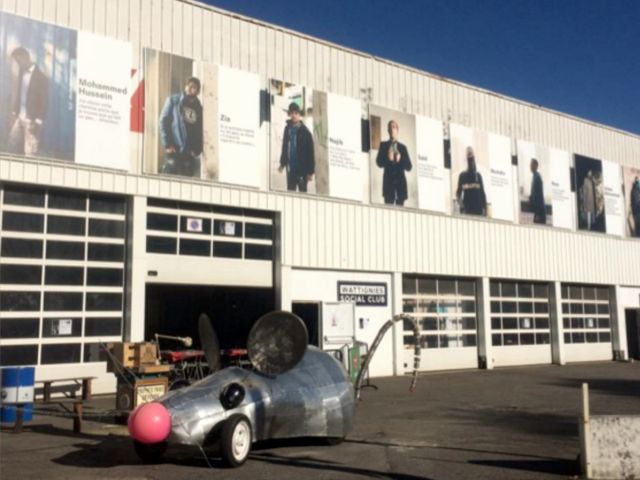

## description

Ce lieu est en cours de fabrication, en cours d'exploration. L'ambition est de créer un lieu social un peu à l'image des "places de villages". Volonté de prendre de la distance avec l'approche quantitative et la phagocythose pour mieux protéger les micro-initiatives et soigner les petites actions. Le projet intègre un bar, le "SALUT" (Syndicat des Artisans Libres Utopistes et Travailleurs).

>  Situé dans un ancien garage automobile de 800 mètres carrés, au cœur de l’île de Nantes, le Wattignies Social Club est un lieu indépendant dédié au tuning d'expérimentations urbaines. Son agencement « délicieusement bordélique » évoque le foisonnement d’idées. Sur place, on y croise des chercheurs qui viennent débattre des enjeux de société, des artisans, des associations, des chômeurs, des migrants, des chefs d’entreprises en quête de sens, des citoyens engagés… Bref, on mixe les activités et les publics pour « faire société ». 

