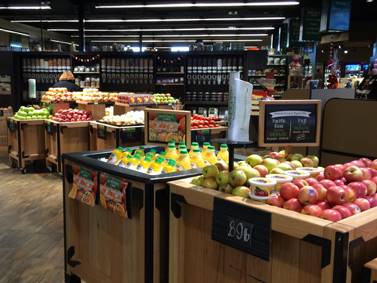

## description

Les choix se portent sur la qualité des produits sélectionnés (produits bio pour l’essentiel) grâce à une exigence gustative, nutritionnelle et sanitaire élevée. Scopéli favorise le développement d’une agriculture durable, à la fois favorable aux paysans et respectueuse de l’environnement.

