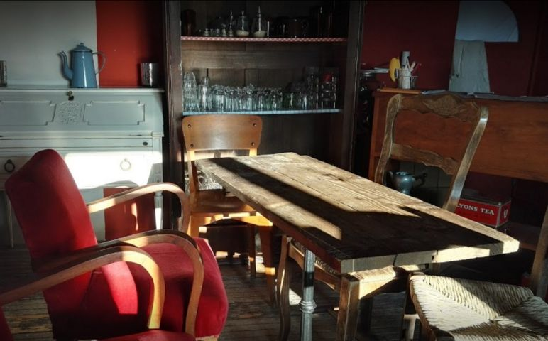

## description

> Avec les Voyageurs, nous assumons volontiers notre côté de doux-rêveurs parce que c’est dans ce lieu privilégié, place de la Mairie à Lanvéoc, dégagés de toute la négativité des pragmatiques fanatiques du status-quo, que nous inventons, par la voie de la moindre résistance, une façon sereine de partager nos espaces, nos idées, nos imaginaires, nos repas, littéralement notre pain (co-pain), notre temps, notre affection …

Je ne sais pas bien comment on s'y rend, je sais par contre qu'une fois la porte passée on s'y sent bien et qu'on est bien accueilli. Les initiatives sont nombreuses et les valeurs portées par le lieu sont très très humaines. On y danse, on s'y pose, on y lit et on échange sans fin.

