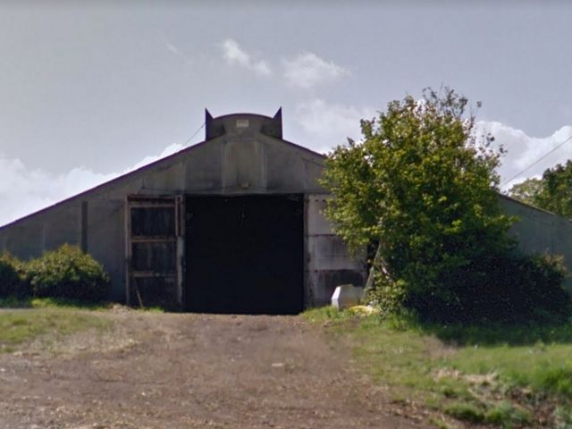

## description

> C’est dans une petite ferme située à Argol, à l’entrée de la presqu’île de Crozon dans le Finistère, que pousse silencieusement le Shiitaké, un champignon réputé pour ses nombreuses vertus médicinales et gustatives !

Marion cultive des champignons, pour l'instant des Shitakés et d'ici à la fin de l'année des pleurotes. Elle livre les restaurants, les magasins de product·eur·rice·s et propose un "marché" dans son hangar.

