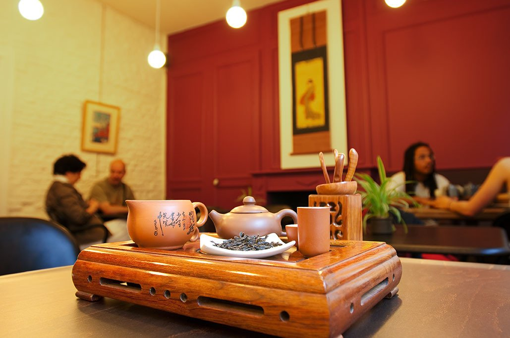

## description

> Unami est une maison de thé généraliste pour novices et connaisseurs, qui offre une large gamme de thés natures, des thés aromatisés et parfumés, et des thés d'origine (Chine, Japon, Corée, Taiwan, Inde…) dont des Grands Crus.

Une authentique maison de thé qui ravira les amateurs et amatrices de thés authentiques. La qualité est au rendez-vous et les conseils éclairés sont proposés avec gentillesse. On y trouve des poteries fines et des thés de qualité. 

Le salon propose une très belle carte de thés. Des ateliers gratuits ou payants  sont également dispensés pour découvrir et approfondir.

