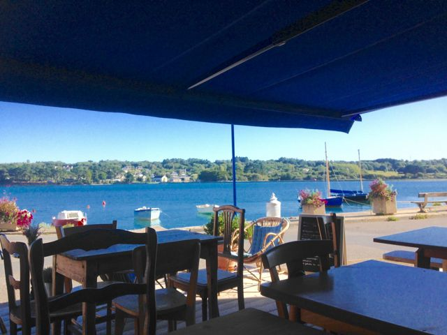

## description

> Nous sommes un restaurant/salon de thé sur le port du Fret en Presqu'île de Crozon. (...) Nos produits sont tous bio et au maximum locaux (pain, fromage, œufs, farine, beurre, légumes, poissons, algues, bière, cidre, jus de pomme, kombucha - café et chocolat transportés à la voile). 

Elsa et sa famille proposent des plats raffinés et originaux avec parfois des petites notes japonaises. De la qualité de la cuisine, de la gentilesse des serveuses et de l'atmosphère chaleureuse au bord de l'eau émergent des instants uniques et charmants.

