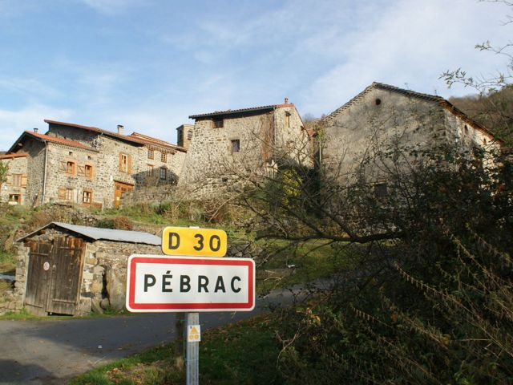

## description

Lieu de rencontre situé juste en face de l'Abbaye de Pébrac, le café associatif L'Aurélie propose de la bière artisanale, des tisanes naturelles, des petites assiettes de fromages, tapenade, caviar d'aubergine. L'ambiance est chaleureuse.

Dans un petit renfoncement se niche des publications de la maison d'édition [la lenteur](https://librairie-quilombo.org/La-Lenteur) pour découvrir de nouvelles pensées sur la condition paysanne ou explorer les mal-faits du numérisme.

